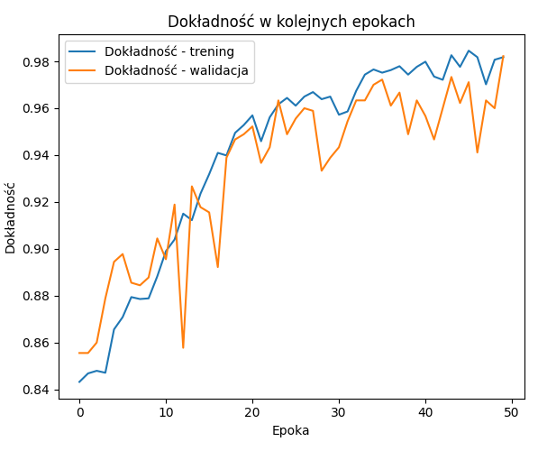

# Gym Technical Error Detection with 3D CNN

## Table of Contents
- [Description](#description)
- [Technologies](#technologies)
- [Errors Detected](#errors-detected)
- [Experiment Setup and Training Parameters](#experiment-setup-and-training-parameters)
- [Evaluation Metrics](#evaluation-metrics)
- [Results](#results)
- [Author](#author)

## Description

This project involves training a neural network designed to detect technical errors in gym exercises, with a focus on bench press technique. Utilizing a 3D Convolutional Neural Network (3D CNN) architecture, the model performs multi-label detection on video sequences. This enables it to capture both spatial and temporal features, thus identifying subtle form errors during the exercise.

## Technologies

- **Python 3.10**
- **OpenCV 4.11.0.86**
- **MoviePy 2.1.2**
- **TensorFlow 2.10.1**
- **Imgaug 0.4.0**
- **Matplotlib 3.10.0**

## Errors Detected

The neural network is trained to recognize the following technical errors, each identified by a unique index:

- **Index 0:** Improper elbow positioning.
- **Index 1:** Hips detaching from the bench during the press.
- **Index 2:** The bar not making contact with the chest.
- **Index 3:** Performing the exercise with half-reps.
- **Index 4:** Incorrect suicide grip.
- **Index 5:** Incorrect technique where the bar is pressed towards the neck instead of the chest.

## Experiment Setup and Training Parameters

The experiments were conducted using a 3D CNN model tailored for multi-label detection of technical errors in bench pressing. Key parameters and configuration details include:

- **Training Epochs:** 50  
  Chosen to provide the model with sufficient learning time while minimizing overfitting.
  
- **Optimizer:** Adam  
  Utilized for its adaptive learning rate, which accelerates convergence and stabilizes training.
  
- **Batch Size:** 6 samples  
  A compromise between hardware limitations and training efficiency, allowing for frequent weight updates without compromising stability.
  
- **Dataset:** Approximately 750 videos  
  Ensures a diverse representation of exercise techniques and error variants.
  
- **Frame Scaling:**  
  All video frames were resized to 112×112 pixels to balance image quality with computational demands.
  
- **Sequence Length:**  
  Each video was divided into a sequence of 32 frames, enabling the model to analyze both spatial and temporal dynamics effectively.

## Evaluation Metrics

To comprehensively assess model performance, several evaluation metrics were employed:

- **Accuracy:**  
  Measures the overall percentage of correct predictions. Note that in multi-label and imbalanced scenarios, accuracy may be misleading.
  
- **Precision:**  
  Indicates the proportion of true positive predictions among all positive predictions, highlighting the reliability of detected errors.
  
- **Recall:**  
  Represents the percentage of actual error cases correctly identified by the model, critical for ensuring all significant errors are captured.
  
- **F1-score:**  
  The harmonic mean of precision and recall, offering a balanced metric especially useful when dealing with imbalanced datasets.

## Results

Below are the plots illustrating the model's training performance, including accuracy, loss, precision, recall, and F1-score.

### Accuracy and Loss

The following plots display the evolution of accuracy and loss over the training epochs:

*Figure 1:* These graphs show the training and validation accuracy along with the corresponding loss values. As the training progresses, accuracy increases while the loss decreases, indicating effective learning. The convergence of these metrics suggests that the model is successfully capturing the underlying features necessary for detecting technical errors.

### Precision, Recall, and F1-Score

The next set of plots focuses on precision, recall, and F1-score:

*Figure 2:* These graphs illustrate the evolution of precision, recall, and F1-score over the training epochs. The metrics provide deeper insight into the model's performance:
- **Precision** reflects the proportion of correctly identified positive predictions.
- **Recall** measures the model's ability to capture all actual error instances.
- **F1-score** combines precision and recall to offer a balanced evaluation of the model's performance.

The progressive improvement in these metrics over time confirms that the model not only learns to classify errors accurately but also maintains a balanced performance across the various error categories.

## Author

The project was created by Piotr Rakocki.
